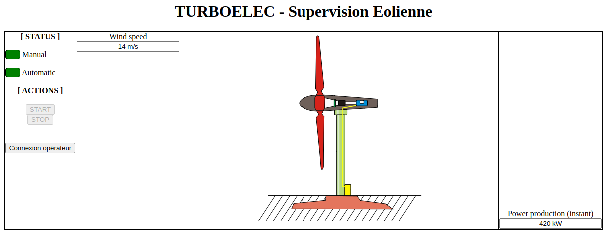

# Instance Docker

## Configuration
Le mot de passe du compte "operator" ("operator" par défaut) peut être configuré dans le fichier Dockerfile, à la ligne :
```
RUN echo SetEnv OPERATOR_PWD operator >> /etc/apache2/conf-enabled/environment.conf
```

## Construction
1. Se déplacer dans le dossier $git_simics$/Eolienne/
2. Executer
```
$ docker build -t simics_eolienne .
```

## Lancement et récupération de l'adresse IP
### Linux
```
$ DOCKER_ID=$(docker run --rm --detach simics_eolienne)
$ docker inspect --format '{{ .NetworkSettings.IPAddress }}' $DOCKER_ID
```

### Windows

*Note : Docker Desktop for Windows ne permet pas l'exposition des ports. L'exemple suivant permet de lier le port du container avec celui de l'hôte*

```
cmd> for /f "delims=" %i in ('docker run --publish 80:80 --publish 502:502 --rm --detach simics_eolienne') do set DOCKER_ID=%i
cmd> docker inspect --format='{{.NetworkSettings.IPAddress}}' %DOCKER_ID%
```

## Services accessibles

```
$ nmap -n -p- --script=modbus-discover <EOLIENNE_IP>
Starting Nmap 7.93 ( https://nmap.org ) at 2025-03-07 09:44 CET
Nmap scan report for A.B.C.D
Host is up (0.000063s latency).
Not shown: 65533 closed tcp ports (conn-refused)
PORT    STATE SERVICE
80/tcp  open  http
502/tcp open  modbus
| modbus-discover: 
|   sid 0x42: 
|     Slave ID data: HAXOM-SIMU-TURBOELEC-1.3.0\xFF
|_    Device identification: HAXOM SIMU-TURBOELEC 1.3.0

Nmap done: 1 IP address (1 host up) scanned in 1.03 seconds
```

- IHM de supervision web [http://<EOLIENNE_IP/](http://<EOLIENNE_IP/) (**l'accès est en HTTP et non HTTPS**)



## Suppression
```
$ docker rmi simics_eolienne
```
